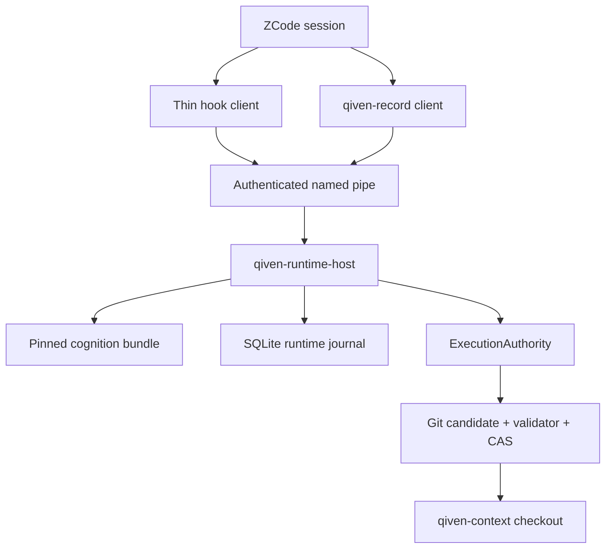
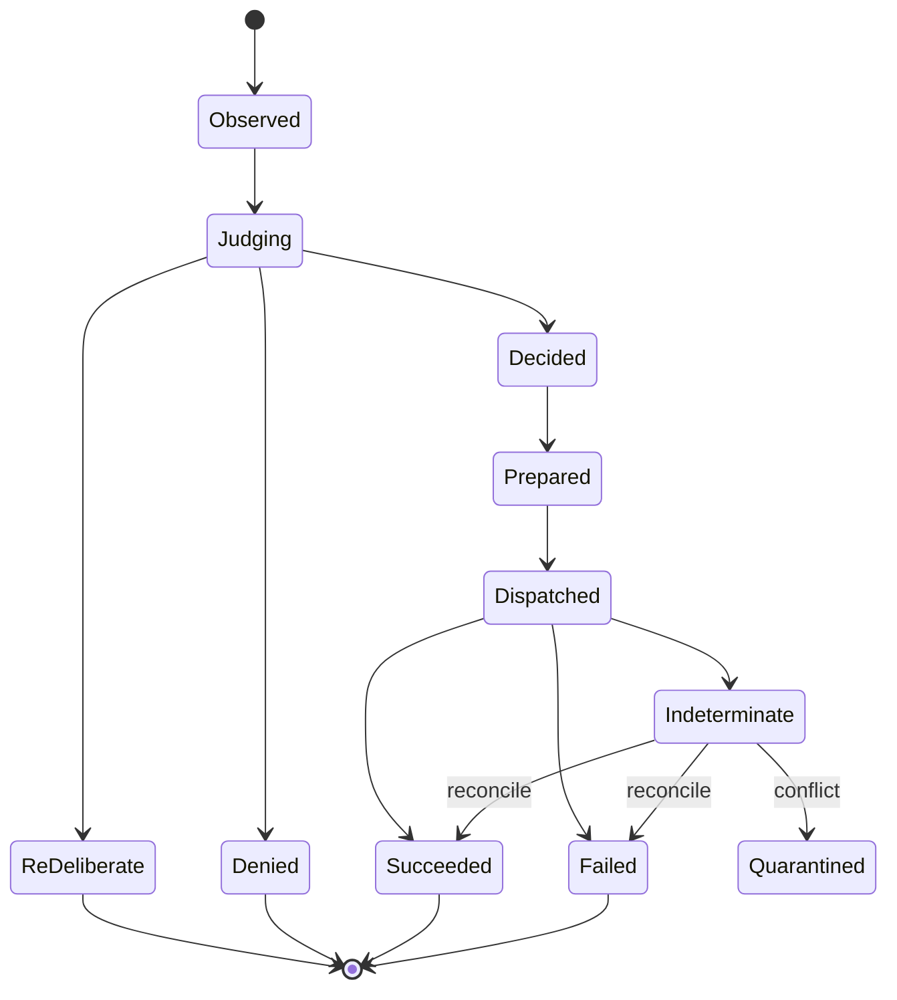

# qiven-runtime Production MVP Architecture

## From a Real ZCode Hook to a Usable, Enforceable Runtime

> Status: **ACCEPTED implementation baseline for the MVP** (ADR-0047, owner-accepted 2026-09-22; the former "Proposed implementation baseline" label corrected 2026-09-26 per the accepted qiven-docs PR4 audit)
> Date: 2026-09-22 (accepted 2026-09-22; doc-repair labels 2026-09-26)
> Repositories in scope: `qiven-runtime`, `qiven-context`, and `qiven-context-draft`
> Primary decision: Do not begin by building a generalized local record database. First complete one production-grade vertical slice that is usable in daily work, can deny unsafe actions, is fully auditable, and can recover deterministically from crashes.
> MVP-4 exit amendment (2026-09-26, ADR-0055): the interim MVP-4 exit gate is the **simulated ZCode hook lifecycle gate** — real hook executable + RuntimeHost over the real pipe with an independently sourced simulated caller; a pass is reported `MVP4_SIMULATION_ACCEPTED` with the standing `INSTALLED_DESKTOP_EXECUTION_UNVERIFIED` residual. The real owner-live H1 trial is retired as the interim acceptance instrument; real-harness build/execution on the owner machine is banned. Real-H1 wording elsewhere in this document reads under that amendment.

### Normative language

The keywords **MUST**, **MUST NOT**, **REQUIRED**, **SHALL**, **SHALL NOT**, **SHOULD**, **SHOULD NOT**, and **MAY** are used normatively. Requirements stated with **MUST** or **MUST NOT** are release gates, not implementation preferences.

---

## 0. Executive Decision

The MVP SHALL implement exactly one deliberately narrow but genuinely end-to-end product scenario:

> In a single-user, single-workspace, single foreground ZCode session, the user modifies `qiven-context` through a typed `qiven-record` request. `qiven-runtime-host` performs cognition activation, intent classification, requirement resolution, decision binding, execution admission, exclusive mutation, repository validation, Git compare-and-swap commit, outcome observation, and crash recovery. Any tool invocation that attempts to modify a governed path while bypassing this chain is denied.

This vertical slice advances the completed ADL38 work and the successful real-hook experiment from **events demonstrably reach the adapter** to **the runtime demonstrably controls whether an effect may occur**.

The central MVP process SHALL be a user-mode, session-resident `qiven-runtime-host.exe`. The ZCode hook SHALL be a thin client. It SHALL NOT retain authoritative state, make independent policy decisions, or write `qiven-context` directly. Every governed mutation SHALL be performed by the ExecutionAuthority owned by RuntimeHost.

The MVP explicitly excludes a general-purpose agent platform, a general event bus, semantic interpretation of arbitrary shell programs, multi-workspace clustering, automated GitHub push/PR/merge, and any authority transition from Git-backed `qiven-context` files to Snapshot-as-truth.

---

## 1. Current-State Assessment and Evidence Boundary

### 1.1 Exact baselines used by this design

| Artifact | Exact baseline | Role in this design |
|---|---|---|
| `qiven-runtime` | `43c0535d3df35d0721485d8483a6195df1fc13f6` (design-time); **refreshed 2026-09-22/23: MVP-0 landed at merge `eba554a`, main continues from there** | C++ implementation and test baseline |
| `qiven-context` | `505f7443951fe99cd8005c28e12a70222d5112d2` (design-time); refreshed to `c190a4c` (ADR-0047 accepted) | Production semantics, record formats, validators, and real-hook evidence |
| `qiven-context-draft` | `73a4bfa2a9068b6c3e37319585732ac1f89f5ef7` (design-time); pinned consumption now `de7f0e1` (docs-only descendant chain; v4 semantics unchanged) | The frozen-v4 dependency pinned by `qiven-runtime` |
| Engineering proposal | [`legacy/runtime-production-activation-proposal.md`](legacy/runtime-production-activation-proposal.md) | Historical input (product pressure and delivery thinking); delivery order superseded — legacy since 2026-09-23 |

Baseline-refresh law (cold-boot drift fix, 2026-09-23; refined same
day): this table pins DESIGN-TIME provenance plus the accepting anchor
of each MVP batch. It refreshes when an MVP batch (MVP-0..MVP-7) or a
pin move lands — not on every engineering PR; live repository heads
are carried by qiven-context state at cold boot. Current anchor: MVP-3
complete — MVP-1 `763ff26`, MVP-2 runtime PR #46 `e22462b` + qiven-context
`runtime/invocation-policy.yaml` PR #118 `662d563`, MVP-3 PR #47 `59ea55c`
(foundation pin `79e6789`, draft pin `7583724`, third-party singleton pin
`3184538`). Design-time originals stay recorded for provenance.

### 1.2 What has already been demonstrated

The real-hook experiment has demonstrated that:

1. A real ZCode session can emit SessionStart-, PreToolUse-, and PostToolUse-class events.
2. Hook events can reach the native bridge executable.
3. Distinct Bash requests can be distinguished and assigned stable payload digests.
4. At least one real observation path can produce valid evidence.
5. The current bridge is sufficient to remain as an adapter probe and regression-test fixture.

### 1.3 What has not yet been demonstrated

The experiment has not yet demonstrated that:

- Runtime can decide and enforce the decision before a real side effect occurs.
- The bytes ultimately executed are exactly the bytes authorized by the decision.
- An alternative write mechanism cannot bypass Runtime and mutate the same governed path.
- Decisions, dispatches, observations, and barriers remain consistent across process restarts.
- Runtime avoids blind retries when it crashes after preparing an effect but before learning its outcome.
- One logical `qiven-context` mutation is atomic across record files, derived indexes, repository validation, and the Git ref.
- The active cognition source, Git revision, content digest, deployment profile, and RuntimeGeneration are auditable.
- Governed mutations fail closed when either the hook or RuntimeHost is unavailable.

The current maturity level is therefore **real traffic connected**, not **production control loop closed**.

---

## 2. Disposition of the Existing Engineering Proposal

The following principles from the proposal are retained:

- The LLM expresses typed intent; a deterministic mechanism emits the final bytes.
- Delivery is CLI-first and begins with a real workflow.
- Local execution is used for bounded latency.
- Git remains the checkpoint, audit, and collaboration boundary.
- Dogfooding begins with a narrow scope rather than nominal support for every tool.

The MVP delivery order, however, MUST change:

| Proposal tendency | Decision in this architecture | Reason |
|---|---|---|
| Build a generalized `qiven-record` and local domain store first | Rejected | It risks creating a second source of truth without proving Runtime control |
| Persist the current state image directly | Rejected | The current image contains only a small subset of token/barrier data and cannot recover dispatches, outcomes, leases, or correlations |
| Let the CLI modify domain files directly | Rejected | A CLI that both expresses intent and writes files bypasses RuntimeHost's execution authority |
| Begin with file persistence and strengthen it later | Replaced with a SQLite control journal from the start | Real effects require transactions, uniqueness constraints, WAL durability, recovery queries, and explicit crash points |
| Support many record types early | Replaced with one closed vertical slice | Control correctness has higher value than superficial breadth |

The resulting boundary is precise: `qiven-record` is a typed request client; RuntimeHost is the sole mechanism executor. SQLite stores Runtime control facts and audit history only. It MUST NOT become the domain source of truth for `qiven-context`.

---

## 3. MVP Product Definition and Governance Claim

### 3.1 The only initial DeploymentProfile

Profile ID:

```text
zcode-jason-context-record-mvp
```

The initial environment is fixed to:

- one Windows user account;
- one `qiven-context` checkout;
- one foreground ZCode session;
- one RuntimeHost instance;
- one local Git commit as the mutation-completion boundary;
- the existing GitHub `main` branch as the canonical publication boundary;
- no automated push, pull request, or merge.

### 3.2 Governed resource scope

The profile MUST express governed resources using both normalized absolute paths and Git-relative paths. The initial set includes:

- `state/active-work.yaml`;
- `state/current.md`;
- `memory/records/**`;
- generated indexes associated with those records;
- obligation records and indexes;
- session checkpoint records.

The deployed list SHALL use the exact paths accepted by the current `qiven-context` schemas and validators. The profile MUST enumerate them explicitly and MUST NOT claim an unconstrained disk-wide scope or rely on an ambiguous glob.

### 3.3 Complete-mediation claim

Runtime may make a hard enforcement claim only for a tuple it actually mediates:

```text
(Actor, OperationClass, ResourceScope)
```

The initial hard claim is:

```text
(ZCodeForegroundSession,
 {FileSystemWrite, RecordMutation},
 qiven-context governed paths)
```

Within this tuple:

- read-only operations are permitted only by a strict allowlist;
- a syntactically valid `qiven-record` launcher invocation may enter Runtime;
- native Write/Edit tools, redirections, script interpreters, Git plumbing, and every other mechanism capable of changing a governed path MUST be denied unless the process is a controlled child of RuntimeHost;
- an unknown tool, an unknown argument form, or hook-protocol capability drift MUST fail closed;
- an operation outside the governed tuple MUST return `NotGoverned`; it MUST NOT be represented as safety guaranteed by Runtime.

Intercepting Bash alone is not complete mediation. Before release, the MVP MUST enumerate every current ZCode tool entry point capable of writing files and prove through real H1 tests that each entry point is either mediated or disabled.

> **Amendment 2026-09-26 (ADR-0055):** the enumeration duty is unchanged;
> the interim proof carrier is the simulated ZCode hook lifecycle gate at
> the exact candidate head (see the status banner), with the
> writable-child/subagent bypass as a required negative coverage case.

---

## 4. Non-Negotiable Architectural Invariants

1. **Runtime remains independent of the participant.** Runtime MUST NOT depend on the LLM voluntarily invoking it, and prompt compliance MUST NOT be treated as enforcement.
2. **Snapshots and bundles are immutable.** One Judgment reads exactly one pinned RuntimeGeneration. Its cognition view MUST NOT be replaced while the Judgment is in progress.
3. **Revision identity and content identity are distinct.** A Git commit OID identifies source revision; SHA-256 identifies content. The implementation MUST NOT overload one field with both meanings.
4. **Compare-and-swap is the only commit semantic.** Every canonical mutation carries an expected base revision. A conflict MUST NOT overwrite the competing state.
5. **Cognition authority and execution authority are orthogonal and conjunctive.** CanonicalCognitionPort determines how the action should be judged. ExecutionAuthority determines whether Runtime currently has authority to produce the effect. Both are REQUIRED.
6. **The harness is an observed boundary, not a self-invocation boundary.** `ObservedAction` is not `ActionIntent`. `declare_intent` may provide advisory input only.
7. **A late BeforeJudgment requirement cannot be backfilled into the current Judgment.** If no valid ActivationReceipt existed before the Judgment opened, the proposal MUST end as `ReDeliberate`, followed by a new Judgment.
8. **Authorization binds to the final bytes.** An allow token MUST bind the full request, candidate digest, generation, profile, scope, actor, transaction, and expiry.
9. **Intent is durably recorded before an external effect.** Runtime MUST commit `DispatchIntent` before invoking any effectful mechanism. An unconfirmed outcome becomes `Indeterminate`; it MUST NOT trigger a blind retry.
10. **Single writer plus fencing.** At most one valid write lease exists per workspace. The fencing epoch MUST be revalidated immediately before the Git ref CAS.
11. **`qiven-context` files and Git remain the domain truth during the MVP.** Bundles, SQLite, and the working-tree projection are not new domain authorities.
12. **No implicit dual-write period exists.** A future transition to Snapshot-as-truth requires a separate ADR, migration gate, and rollback procedure.
13. **The sealed Python ContextKernel remains sealed.** Existing Python validators MAY run as external mechanical checks. Cognition delivery and decision semantics belong to Runtime.
14. **A hard-governed failure denies rather than falsely allows.** For out-of-scope work, Runtime returns `NotGoverned` rather than overstating its authority.

---

## 5. Target Topology



Control-plane and domain-plane data are intentionally separate:

| Plane | Data | Authority | Lifetime |
|---|---|---|---|
| Cognition input | Exact Git revision, policy, roles, and required source files | Authoritative source for cognition | Immutable per bundle/generation |
| Runtime control | Sessions, transactions, decisions, leases, dispatches, outcomes, and barriers | Authoritative record of Runtime control | Durable SQLite journal |
| Domain state | `qiven-context` records, indexes, and Git commits | Current domain truth | Governed by existing Git rules |
| Working-tree projection | Files visible in the checkout | Non-authoritative cache/projection | Repairable from the committed tree |
| Hook telemetry | Raw host events and digests | Observation evidence | Retained minimally |

---

## 6. Components and Responsibility Boundaries

### 6.1 `qiven-runtime-host.exe`

RuntimeHost is the only resident component and the production composition root. It owns:

- process singleton and workspace lifecycle;
- secure IPC and client/session identity establishment;
- DeploymentProfile loading and coverage declaration;
- CanonicalCognitionBundle acquisition, validation, pinning, and generation management;
- ObservedAction normalization, IntentClassifier execution, and requirement derivation;
- ResolverRegistry operation and EvidenceReceipt validation;
- DecisionBinder and execution admission;
- RuntimeJournal transactions and recovery;
- ExecutionAuthority, leases, and fencing;
- record candidate construction, validator execution, and Git CAS;
- outcome observation, reconciliation, barriers, and quarantine;
- read-only query support for `qiven-runtimectl`.

RuntimeHost SHALL run as a user-level process, not a Windows service, and SHALL NOT require administrator privileges. The SessionStart hook MAY start it lazily. A named mutex guarantees one process per installation identity. The MVP MAY support idle shutdown, but shutdown MUST first checkpoint the WAL and release leases. RuntimeHost MUST NOT silently exit while a dispatch remains unresolved.

### 6.2 `qiven-zcode-hook.exe`

This is a thin adapter for SessionStart, PreToolUse, and PostToolUse. It SHALL only:

- read the host event from stdin and the approved environment;
- attach host metadata and the raw payload digest;
- submit an authenticated request to RuntimeHost;
- map `Allow`, `Deny`, `NotGoverned`, or `ReDeliberate` to the exact ZCode hook response contract within the hook deadline;
- fail closed for hard-governed mutations when RuntimeHost is unavailable, times out, or rejects the protocol version.

It MUST NOT classify independently, retain an authoritative session/action counter, issue decisions, execute mutations, or convert a failure into an allow response.

The existing `qiven-adapter-bridge` remains a protocol probe and conformance-test fixture. It MUST NOT be expanded into the production host.

### 6.3 `qiven-record.exe`

`qiven-record` is a typed request client. It provides a stable human/LLM-facing command surface but never edits `qiven-context` itself. Initial operations are:

- `memory.add`;
- `obligation.create` and `obligation.transition`;
- `active_work.patch`;
- `session_checkpoint.write`.

One request MAY contain multiple operations, which MUST succeed or fail atomically. Long content SHALL be supplied through stdin or an explicit `--request-file`; it SHALL NOT be embedded into a shell command line. The client performs local syntax validation and IPC only. RuntimeHost assigns IDs and timestamps, applies defaults, selects file layout, emits YAML/Markdown bytes, and rebuilds indexes.

### 6.4 `qiven-runtimectl.exe`

This is a read-only operational client. It MUST initially support:

```text
status
profile show
cognition show
session list
transaction show <id>
barrier list
reconcile <transaction-id>
doctor
```

`reconcile` means deterministic reinspection of authoritative state. It does not mean “force success.” Administrative override for quarantine or barriers is outside the MVP. If human repair is required, the initial release MUST stop governed writes and report the condition explicitly.

### 6.5 Minimal `qiven-process` slice

The real ADL38 activation now satisfies the trigger for a mechanical process-execution boundary. The MVP SHALL implement only the subset Runtime needs:

- explicit executable plus argv; no shell command strings;
- explicit working directory and a minimal environment allowlist;
- Windows Job Object with kill-on-close;
- bounded, concurrent stdout/stderr capture;
- deadline, graceful termination, and forced termination;
- exit code, termination reason, and output digests;
- no inherited stdin or unrelated handles;
- executable allowlisting by DeploymentProfile.

The component serves Git and the existing validator. It is not a general task scheduler.

---

## 7. Production Delivery of Canonical Cognition

### 7.1 Why RuntimeHost must not read a dirty checkout directly

If a production Judgment reads the current checkout, uncommitted edits, concurrent changes, and source revision become inseparable. The audit trail can no longer prove which cognition governed a decision. Runtime MUST construct every active cognition view from an exact Git commit.

### 7.2 `qiven-cognition-bundle-v1`

A Runtime-side `CanonicalCognitionPublisher` SHALL read and validate an exact Git commit/tree and produce an immutable bundle:

```text
bundle/
  manifest.json
  snapshot.qvs
  policy.yaml
  source/
    ...exact source files and indexes required by resolvers...
```

`manifest.json` MUST include at least:

```json
{
  "schema": "qiven-cognition-bundle-v1",
  "repository": "https://github.com/JasonHuang3D/qiven-context.git",
  "source_revision": "<git-commit-oid>",
  "source_tree": "<git-tree-oid>",
  "view": "production",
  "snapshot_format": 8,
  "snapshot_sha256": "<sha256>",
  "policy_sha256": "<sha256>",
  "source_files": [{"path": "...", "sha256": "..."}],
  "publisher_build": "<runtime-build-id>",
  "published_at": "<rfc3339>"
}
```

Rules:

- `source_revision` is a revision identifier. A file SHA-256 MUST NOT substitute for it.
- The bundle is a reproducible derivative, not a new canonical source of truth.
- Every file named by the manifest is individually hashed and revalidated on load.
- `snapshot.qvs` contains only stable semantics that frozen-v4 can represent without information loss.
- Rich records remain available as exact source files in the bundle. They MUST NOT be forced through a lossy frozen-v4 import merely to claim a unified model.
- The active-bundle pointer changes through atomic rename.
- A pointer change does not mutate an already-created RuntimeGeneration.

### 7.3 A single machine-readable policy source

`qiven-context` SHALL gain one canonical machine-readable invocation-policy instance, for example:

```text
runtime/invocation-policy.yaml
```

This file is the machine instance of the existing specification, not a second policy authored independently. It MUST encode at least:

- ActionIntent-to-RequirementKind mappings;
- requirement boundaries;
- resolver types and minimum versions;
- evidence freshness constraints;
- deny and re-deliberation behavior;
- the hard-gate policy digest required by a profile.

The human-readable ADL, supporting documentation, and this file MUST be reference-checked by validation so that two divergent policies cannot silently emerge.

### 7.4 Refresh and RuntimeGeneration rules

At SessionStart, RuntimeHost SHALL:

1. perform a bounded fetch from the configured remote;
2. resolve the authorized exact ref;
3. validate the commit/tree, policy, and bundle schema;
4. publish a new bundle;
5. create a RuntimeGeneration from bundle digest, profile digest, and Runtime build identity;
6. pin the session to that generation.

If fetch fails but a verified local bundle exists within the profile's explicit freshness window, Runtime MAY use it. Once the window expires, governed mutations MUST be denied. Runtime MUST NOT fall back to the dirty checkout.

A bundle, profile, or governing Runtime-build change creates a new RuntimeGeneration. Every unconsumed Allow issued under an older generation becomes stale. An already-dispatched action remains attached to its original generation for observation and reconciliation.

---

## 8. End-to-End Control Path for One Request

```mermaid
sequenceDiagram
    participant Z as ZCode
    participant H as Hook/record client
    participant R as RuntimeHost
    participant J as Journal
    participant G as Git + Validator
    Z->>H: observed action / typed request
    H->>R: authenticated envelope
    R->>J: create transaction + pin generation
    R->>R: classify + derive requirements
    alt BeforeJudgment evidence missing
        R->>J: close as ReDeliberate
        R-->>H: context + one-time resume token
        H-->>Z: deny current action; return context
    else requirements satisfied
        R->>J: bind decision; consume; create DispatchIntent
        R->>G: build candidate, validate, CAS ref
        G-->>R: commit/ref observation
        R->>J: persist outcome and close transaction
        R-->>H: typed result
        H-->>Z: result/context
    end
```

### 8.1 Required phases

Every governed request passes through the following phases:

1. `Observed`: validate and accept the envelope.
2. `Classified`: construct a canonical ActionIntent and ResourceScope.
3. `JudgmentOpened`: pin generation, profile, actor, and base revision.
4. `RequirementsDerived`: create requirements with explicit boundaries.
5. `EvidenceResolved`: accept versioned resolver receipts through ResolverRegistry.
6. `DecisionBound`: issue a decision bound to the exact candidate.
7. `DecisionConsumed`: consume the decision exactly once.
8. `LeaseAcquired`: acquire a workspace fencing lease.
9. `DispatchPrepared`: durably record the final execution plan and candidate digest.
10. `Dispatched`: execute the step that may create an external effect.
11. `OutcomeObserved`: verify ref, commit, validator result, and projection.
12. `Closed`, `Indeterminate`, or `Quarantined`.

### 8.2 Hard semantics of `ReDeliberate`

The current implementation must correct a critical timing issue: a BeforeJudgment requirement discovered and resolved inside the current proposal MUST NOT authorize that same proposal.

The required protocol is:

1. The first proposal reveals an unsatisfied BeforeJudgment requirement.
2. Runtime performs the required retrieval and produces an EvidenceReceipt.
3. The current transaction ends as `ReDeliberate`; it does not produce an Allow.
4. Runtime returns compact prepared context and a single-use resume token.
5. The participant forms a new action.
6. The new action creates a new transaction whose `causal_parent` references the prior transaction.
7. Only an unexpired ActivationReceipt/resume token whose type, source, digest, and generation match the new Judgment may pre-satisfy its BeforeJudgment requirement.

This is not a user-experience optimization. It preserves the causal rule that an agent cannot decide first, investigate later, and retroactively authorize the original decision.

### 8.3 ResolverRegistry

A resolver cannot remain an interchangeable function pointer. The registry SHALL select and validate resolvers by at least:

```text
(RequirementKind, ResolverType, ResolverVersion, CognitionView)
```

An EvidenceReceipt MUST persist:

- requirement ID;
- resolver type, version, and build;
- source revision and source path;
- evidence type and content digest;
- `issued_at` and `expires_at`;
- the policy digest under which it was accepted;
- RuntimeGeneration ID;
- whether reuse across transactions is permitted.

DecisionBinder SHALL consume only receipts accepted by ResolverRegistry and persisted in RuntimeJournal. It MUST NOT accept free-form strings or a caller's assertion that the material was reviewed.

---

## 9. Typed Record Transaction

### 9.1 Request protocol

Minimal example:

```json
{
  "schema": "qiven-record-request-v1",
  "request_id": "0199...",
  "workspace_id": "sha256:...",
  "expected_base": "<git-commit-oid>",
  "operations": [
    {
      "op": "memory.add",
      "title": "Runtime MVP execution boundary",
      "body": "...",
      "tags": ["runtime", "mvp"],
      "evidence_refs": ["..."]
    }
  ]
}
```

Rules:

- `request_id` is an idempotency key. Replaying the same ID with the same canonical request digest returns the original result. Reusing the ID with a different digest is rejected.
- `expected_base` is REQUIRED so Runtime cannot write onto a base unknown to the caller.
- The schema SHALL impose explicit limits on total bytes, nesting depth, string length, and operation count.
- RuntimeHost SHALL apply an explicit Unicode-normalization policy while preserving the intended semantic fields.
- Unknown fields and unknown enum values are rejected by default. Protocol evolution requires an explicit version.
- The schema rejects secrets, credentials, and personal data outside the approved classification before candidate construction.

### 9.2 Domain-generation rules

RuntimeHost first constructs a typed domain object, then a deterministic renderer emits bytes:

- RuntimeHost generates IDs and timestamps.
- A pinned YAML emitter version is used.
- Output is UTF-8 with LF line endings, exactly one final newline, and no trailing whitespace.
- The title has one projection rule across front matter, H1, and indexes.
- Indexes are derived from records; callers cannot edit an index directly.
- Paths are derived from record type and ID; callers cannot supply arbitrary paths.
- Both the typed object and rendered output receive content digests.
- Identical input under the same RuntimeGeneration and renderer build MUST produce the same candidate tree.

### 9.3 Git candidate transaction

The order of one record transaction is fixed:

1. Verify that `expected_base` equals the authorized branch ref.
2. Construct an isolated candidate tree from the base tree.
3. Apply every typed operation.
4. Rebuild affected indexes.
5. Materialize the candidate through an isolated temporary directory or temporary index.
6. Execute the existing repository validator through `qiven-process`.
7. Verify bounded stdout/stderr, exit code, and output limits.
8. Write the candidate tree and commit object.
9. Revalidate the workspace fencing epoch.
10. Update the authorized local branch using a ref CAS from expected old OID to new OID.
11. Observe that the branch ref points to the candidate commit.
12. Update the working-tree projection using preimage checks.
13. Persist the outcome.

The transaction MUST NOT be implemented by modifying the working tree first and attempting to roll it back after failed validation. The working tree is neither the staging area nor the authority boundary.

Commit attribution SHALL follow the existing qiven-context Role/LLM/Reasoning conventions and use configured Git identity. Runtime MUST NOT invent an email address or author identity.

### 9.4 Publication boundary

MVP success produces a validated, auditable local candidate commit. It does not:

- push to GitHub;
- create a pull request;
- merge a branch;
- move a remote canonical ref.

A successful local commit is therefore not a successful canonical publication. Result types and user-facing output MUST preserve that distinction.

---

## 10. RuntimeJournal: Durable Control State for Real Effects

### 10.1 Storage decision

The MVP SHALL embed a pinned SQLite 3 amalgamation configured with:

```text
journal_mode = WAL
synchronous = FULL
foreign_keys = ON
single control-thread writer
bounded busy timeout
```

Startup SHALL run `quick_check`; periodic maintenance SHALL run `integrity_check` under a bounded operational policy.

SQLite stores Runtime control facts only. It MUST NOT store the authoritative `qiven-context` domain records. This provides transaction and recovery semantics without creating a second domain truth.

### 10.2 Logical tables and projections

| Table/projection | Essential fields | Required invariant |
|---|---|---|
| `runtime_meta` | schema version, install ID, boot epoch | One logical row; migrations are validated |
| `generations` | generation ID, bundle/profile/build digests, status | Immutable after activation |
| `sessions` | session ID, actor, harness, generation, start/end | Session pins exactly one generation |
| `transactions` | transaction ID, causal parent, request digest, state, base revision | State advances monotonically |
| `actions` | action ID, intent, scope, payload/candidate digest | Complete correlation identity |
| `requirements` | boundary, kind, state | Bound to one Judgment |
| `evidence_receipts` | resolver, source, digest, expiry | Structured, not a free-form string |
| `decisions` | decision ID, binding digest, token hash, expiry, consumed time | Single-consumption uniqueness |
| `leases` | workspace, fencing epoch, holder, expiry | At most one active lease per workspace |
| `dispatches` | dispatch ID, plan digest, state, start/completion | Persisted before external execution |
| `outcomes` | status, commit/ref, validator/result digest | One final observation per dispatch |
| `barriers` | scope, reason, opened/closed, evidence | Active barrier denies mutation |
| `audit_events` | sequence, previous hash, event hash, typed payload | Append-only hash chain |

The physical schema MAY normalize or partition these facts, but it MUST NOT collapse them back into the current thin image containing only consumed-token and barrier-scope integers.

### 10.3 Identifiers and authorization tokens

- Generation, session, transaction, action, decision, and dispatch IDs SHALL be UUIDv7 or an equivalent sortable 128-bit identifier.
- Installation ID is durable; boot epoch increases on every RuntimeHost start.
- CorrelationKey is stored and compared in full. A 64-bit hash is not an identity.
- A 64-bit FNV value MAY accelerate a non-security hash table; it MUST NOT be an authorization token.
- A decision token uses a CSPRNG nonce and SHA-256/HMAC over the canonical binding.
- The database stores only the token hash. Token plaintext exists only in the immediate IPC response/use path.
- The binding covers `generation + session + transaction + action + actor + profile + resource scope + operation + candidate digest + expiry`.

### 10.4 Audit and data minimization

Raw hook payloads are not retained by default. Runtime stores:

- the typed fields needed for the decision;
- payload SHA-256;
- size, source, and protocol version;
- the minimum evidence needed for audit and reconciliation.

Raw-body diagnostics require an explicit, time-bounded mode with strict size limits. Enabling and disabling that mode SHALL itself be audited.

Database corruption, an unknown schema version, or a broken audit hash chain places Runtime in quarantine. Runtime MUST NOT create an empty database and resume mutations automatically. Read-only diagnostics MAY remain available; governed mutation MUST stop.

---

## 11. ExecutionAuthority, Lease, and Unknown Outcomes

### 11.1 Single-writer model

At most one valid writer lease exists for a workspace. The lease includes:

```text
(workspace_id, holder_install_id, holder_boot_epoch,
 fencing_epoch, acquired_at, expires_at)
```

`fencing_epoch` increases monotonically inside a SQLite transaction. RuntimeHost acquires the lease before recording DispatchIntent and validates the fence again immediately before the Git ref CAS. A process mutex prevents duplicate hosts for one user installation. Git CAS prevents repository-level lost updates. Neither mechanism replaces fencing.

### 11.2 Durability order

The critical execution sequence is:

```text
SQLite transaction:
  consume decision token
  acquire or renew lease and fencing epoch
  insert immutable dispatch plan
  append DispatchPrepared audit event
COMMIT

perform external candidate, validator, and Git operations

SQLite transaction:
  persist observed outcome
  transition dispatch and transaction
  append OutcomeObserved audit event
COMMIT
```

An unavoidable uncertainty window exists after Git ref CAS succeeds but before the outcome is committed to SQLite. Recovery MUST inspect Git rather than retry blindly:

- `ref == candidate OID`: the effect occurred; persist a reconstructed success outcome.
- `ref == expected base OID` and the candidate was not published: no ref mutation occurred; policy may create a new dispatch.
- `ref == any other OID`: mark `IndeterminateConflict` and open a barrier.
- Candidate commit object exists but no authorized ref points to it: the object is unpublished and does not constitute success.

### 11.3 Complete PostActionObserver correlation

Outcome observation MUST validate all available identity fields:

- RuntimeGeneration ID;
- session ID;
- transaction ID;
- action ID;
- dispatch ID;
- harness action ID, when supplied by the host;
- request and candidate digests;
- expected base and observed ref;
- prior observation state.

Comparing only an action digest plus an `already_observed` boolean is insufficient.

---

## 12. IPC and Local Security Boundary

### 12.1 Transport

Use a Windows named pipe:

```text
\\.\pipe\qiven-runtime\<install-id>\v1
```

Requirements:

- The pipe ACL permits only the owning Windows SID.
- RuntimeHost validates client-process owner, PID, and executable path.
- Installation creates a 256-bit client secret protected by DPAPI CurrentUser.
- Each connection uses nonce, timestamp, and HMAC replay protection.
- Frames are length-prefixed UTF-8 JSON v1 with strict size limits.
- The handshake negotiates protocol version, client kind, build ID, and deadline.
- Every request carries a request ID, a monotonic connection sequence, and a deadline.
- Runtime returns explicit deny/timeout before the hook deadline expires.
- Connection loss does not alter the fate of an already-persisted dispatch.

JSON is deliberately retained for the MVP because it improves real-traffic diagnosis. A future CBOR migration is not a prerequisite for closing the control loop.

### 12.2 Identity boundary

RuntimeHost assigns the Runtime session ID. A client MUST NOT choose it. A host-provided session handle MAY be stored as evidence, but it MUST NOT become the Runtime identity.

Static credentials, fixed actor IDs, and fixed action IDs MUST be removed from every production path. They may remain only in explicit test fixtures.

### 12.3 Path and child-process defenses

- Normalize each path, open it, and verify from the resulting handle that it remains inside the authorized repository root.
- Reject traversal through junctions, symbolic links, and reparse points.
- Derive workspace identity from the canonical repository root and repository identity.
- Configure Git and validator executables by absolute path with version or digest constraints.
- Pass only an explicit environment-variable allowlist to child processes.
- Prohibit `cmd /c`, PowerShell string concatenation, and shell expansion.
- Create temporary directories with owner-only ACLs and bind each directory to one transaction/candidate.

---

## 13. State Machines and Recovery Semantics

### 13.1 Transaction state machine



Only explicit RuntimeJournal commands may transition state. Callers cannot assign state directly. Terminal states cannot regress. A request following `ReDeliberate` creates a new transaction.

### 13.2 RuntimeHost startup recovery

Startup order is fixed:

1. Acquire the process mutex.
2. Open the database and verify schema, integrity, and audit hash chain.
3. Increment boot epoch.
4. Mark every unconsumed decision from an older boot epoch stale.
5. Expire old leases without decrementing fencing epoch.
6. Locate transactions in `Prepared`, `Dispatched`, or `Indeterminate`.
7. Inspect authoritative Git refs and objects according to each dispatch plan.
8. Persist a deterministic outcome or open a barrier.
9. Verify or repair the working-tree projection.
10. Load and validate the active cognition bundle.
11. Create the new RuntimeGeneration.
12. Enable the IPC mutation endpoint.

Before recovery completes, RuntimeHost exposes only `status` and `doctor`. Mutation requests return `HostRecovering`.

### 13.3 Working-tree projection repair

The working-tree update may fail after the Git ref CAS succeeds, so the working tree is only a projection. During startup or reconciliation:

- if the ref points to a Runtime-recorded candidate commit, rebuild the affected files from that commit;
- verify preimages before overwriting; if uncommitted user changes are present, preserve them and open a `DirtyProjection` barrier;
- never perform a destructive reset;
- persist the repair outcome in RuntimeJournal.

---

## 14. Source Layout and Required Changes to Existing Code

### 14.1 New modules

Recommended layout:

```text
include/qiven/runtime/
  host/runtime_host.hpp
  host/deployment_profile.hpp
  ipc/protocol.hpp
  ipc/named_pipe_server.hpp
  cognition/bundle.hpp
  cognition/publisher.hpp
  journal/runtime_journal.hpp
  journal/recovery.hpp
  authority/workspace_lease.hpp
  record/command.hpp
  record/domain.hpp
  record/renderer.hpp
  git/candidate_transaction.hpp
  process/process_runner.hpp

src/
  host/...
  ipc/...
  cognition/...
  journal/...
  authority/...
  record/...
  git/...
  process/...

apps/
  runtime_host_main.cpp
  zcode_hook_main.cpp
  record_main.cpp
  runtimectl_main.cpp

config/
  profiles/zcode-jason-context-record-mvp.yaml

schemas/
  ipc/*.schema.json
  record/*.schema.json
  cognition/*.schema.json
```

### 14.2 Mandatory corrections in the current implementation

| Current area | Required change |
|---|---|
| `app/main.cpp` | Replace bootstrap printing with the RuntimeHost composition root, or supersede it with `runtime_host_main.cpp` |
| `adapter/bridge.*` | Retain as probe/conformance fixture; do not add production control state to it |
| `state.*` / ControlCore | Correct BeforeJudgment timing, create an explicit new Judgment, and retain complete EvidenceReceipts |
| Resolver interface | Replace the single `ResolverFn` with a versioned ResolverRegistry |
| `decision.*` | Replace the 64-bit FNV token; bind exact candidate, scope, and generation; persist single consumption |
| `outcome.*` | Validate full correlation, not only digest equality |
| `state_store.*` | Stop treating the thin image as production recovery state; migrate behind a RuntimeJournal port |
| Generation/transaction counters | Replace restart-local counters with durable installation/boot epoch plus 128-bit IDs |
| `DraftSnapshotReader` | Separate source revision from content digest; read only a verified bundle |
| ExecutionAuthority | Replace Null/test implementations with lease, fence, and Git-CAS authority |
| `docs/architecture/runtime.md` | Mark the older process-execution architecture as historical and point to the current cognition/runtime architecture so the repository does not describe two conflicting missions (done: bannered at MVP-0; museumed to `docs/architecture/legacy/runtime-process-execution.md` 2026-09-26) |

### 14.3 Compatibility strategy

Existing pure domain types and unit tests SHOULD remain where possible. The production host composes them through new ports. Do not rewrite the entire core in one batch. Add compatibility adapters so current tests continue to prove frozen-v4 semantics, then add integration tests that prove the new durable boundaries.

---

## 15. Single Implementation Sequence

Each batch has a mandatory exit gate. A batch is not complete because code was merged; it is complete only when its fault and conformance tests pass.

### MVP-0: Close the production contracts

Objective: remove semantic gaps that can produce an invalid allow before adding product breadth.

Work:

- introduce `ResourceScope` and an explicit governance-coverage claim;
- correct BeforeJudgment/ReDeliberate timing;
- introduce ActivationReceipt and causal-parent semantics;
- add ResolverRegistry and complete EvidenceReceipt;
- use complete CorrelationKey values;
- introduce 128-bit IDs and a secure decision-token abstraction;
- mark the current state image test-only/non-production;
- define profile, bundle, and journal ports.

Exit gate:

- unit tests prove that a late requirement can never authorize the current proposal;
- changing payload, scope, or generation invalidates the token;
- a receipt mismatch in type, version, source, or digest is rejected;
- no production path treats equality of a 64-bit hash as identity equality.

### MVP-1: SQLite RuntimeJournal and recovery skeleton

Work:

- pin the SQLite version and build method;
- implement schema, migrations, and WAL/FULL configuration;
- implement generation, session, transaction, decision, lease, dispatch, outcome, barrier, and audit tables;
- implement command-based transitions and uniqueness constraints;
- add a crash-injection framework;
- implement startup recovery and quarantine mode.

Exit gate:

- forced termination at every journal commit point yields a deterministic restart result;
- consumed decisions never reappear;
- fencing epoch never decreases;
- database corruption cannot silently produce a fresh database followed by mutation;
- the audit hash chain verifies.

### MVP-2: Native cognition publisher and DeploymentProfile

Work:

- add canonical `invocation-policy.yaml` to `qiven-context`;
- implement exact Git commit/tree reading;
- implement bundle manifest, snapshot, and source-file digests;
- implement publisher and active-bundle pointer;
- implement DeploymentProfile loader and validator;
- implement generation pinning and stale-decision rules;
- add `runtimectl cognition show` and `profile show`.

Exit gate:

- dirty checkout changes cannot affect a pinned RuntimeGeneration;
- modifying any bundle file makes bundle loading fail;
- Git revision and content digest are separately visible;
- a profile or bundle update creates a new generation and invalidates old unconsumed tokens;
- rich source records are not lossy-converted into the v8 Snapshot.

### MVP-3: RuntimeHost, IPC, and mechanical execution boundary

Work:

- implement the RuntimeHost composition root and singleton lifecycle;
- implement named-pipe ACL, DPAPI secret, nonce, and HMAC;
- implement request/response schemas, bounds, and deadlines;
- implement `qiven-runtimectl status` and `doctor`;
- implement the minimal `qiven-process` slice;
- implement Git/validator executable allowlisting.

Exit gate:

- a non-owner client cannot connect;
- replayed envelopes are rejected;
- host timeout or disconnect maps to deny inside the hard-governed scope;
- a timed-out child process and its process tree are reclaimed;
- large stdout/stderr cannot deadlock RuntimeHost or consume unbounded memory.

### MVP-4: Production ZCode hook adapter

Work:

- implement SessionStart, PreToolUse, and PostToolUse thin clients;
- implement host-version and capability handshake;
- enumerate every write-capable tool entry point;
- implement governed-path detection and a strict read-only allowlist;
- define the accepted `qiven-record` launcher grammar;
- return deny/ReDeliberate context to ZCode;
- assign action/session IDs in RuntimeHost;
- include the current bridge in conformance tests.

Exit gate:

- a real ZCode H1 test proves deny has no fallthrough;
- Bash, Write, Edit, and every discovered write path cannot bypass governed resources;
- unknown tools, fields, and host versions fail closed;
- repeated real actions receive unique IDs and PostAction performs complete correlation;
- an uninstalled or disconnected hook is never reported as governed.

### MVP-5: Typed records and Git candidate transaction

Work:

- implement `qiven-record` request and client;
- implement domain models for the four initial operation families;
- implement deterministic YAML/Markdown rendering;
- implement index derivation;
- implement isolated candidate tree or temporary index;
- invoke the existing `qiven-context` validator;
- implement commit-object creation and local-ref CAS;
- implement request idempotency;
- implement working-tree projection update and repair.

Exit gate:

- all four operation families produce a repository accepted by the validator;
- one batch produces exactly one local commit;
- validator failure changes neither branch ref nor working tree;
- CAS conflict never overwrites a competing update;
- replaying one request ID never creates a second commit;
- reusing a request ID with a different payload is rejected;
- no push, pull request, or merge occurs.

### MVP-6: Real ExecutionAuthority and end-to-end recovery

Work:

- implement workspace lease and fencing;
- atomically persist decision consumption and DispatchIntent;
- implement complete PostActionObserver correlation;
- implement authoritative Git-ref reconciliation;
- implement dirty-projection barriers;
- inject faults into every external-effect window.

Exit gate:

- when two RuntimeHost instances compete, only one writer is effective;
- a lease invalidated before ref CAS cannot execute;
- when the ref changed but the acknowledgement was lost, recovery reports success without duplicate commit;
- when the ref did not change, recovery can prove the publication did not occur;
- when the ref has a third value, Runtime opens a barrier and never guesses;
- restart invalidates old Allows and reconciles pending dispatches.

### MVP-7: Real dogfood and release gate

Work:

- reinstall the hooks in the real `qiven-context` workflow;
- perform the four initial mutation families only through `qiven-record` during the trial;
- collect latency, deny, ReDeliberate, validator, and recovery metrics;
- convert every failure into a reproducible test case;
- complete runbooks for operation, upgrade, rollback, and backup.

Release gate:

- at least seven consecutive days of use;
- at least 20 real record transactions;
- zero invalid canonical writes;
- zero successful bypasses of governed paths;
- zero false Allows;
- zero incidents requiring manual SQLite editing;
- every crash drill recovers deterministically;
- `runtimectl` can map every produced commit to generation, decision, evidence, lease, dispatch, and outcome.

---

## 16. Mandatory Verification Matrix

### 16.1 Control correctness

| Scenario | Required result |
|---|---|
| Raw Bash writes a governed file | Deny; no side effect |
| Native Write/Edit writes a governed file | Deny; no side effect |
| Unknown tool may be able to write | Deny |
| Supported read-only operation | Explicit Allow or NotGoverned according to profile |
| Valid `qiven-record` request | Enter the complete Runtime pipeline |
| RuntimeHost or pipe unavailable | Deny hard-governed mutation |
| Hook payload schema drifts | Deny plus capability-drift audit event |
| Payload changes after decision binding | Token-binding mismatch; deny |
| Old token used after generation transition | `StaleDecision`; deny |
| BeforeJudgment requirement discovered late | Current transaction becomes ReDeliberate; no dispatch |
| Forged, expired, or wrong resolver receipt | Deny |

### 16.2 Atomicity and concurrency

| Scenario | Required result |
|---|---|
| Validator fails | No ref change and no working-tree change |
| Base OID is stale | CAS conflict; no overwrite |
| Same request is submitted twice | Return the same result; exactly one commit |
| Same request ID carries different content | `IdempotencyConflict` |
| Two hosts target one workspace | Only the holder of the valid highest fence may commit |
| Commit object exists but ref is unchanged | Unpublished; not success |
| Ref changed but acknowledgement was lost | Reconcile to success without replaying the mutation |
| Projection update crashes | Git ref remains authoritative; repair safely or open barrier |

### 16.3 Required fault-injection points

Force-terminate RuntimeHost immediately before and after each point:

1. transaction creation;
2. EvidenceReceipt persistence;
3. decision persistence;
4. token consumption;
5. lease/fence allocation;
6. DispatchIntent commit;
7. candidate-tree construction;
8. validator completion;
9. commit-object write;
10. ref CAS;
11. ref CAS success but before outcome persistence;
12. outcome commit but before IPC acknowledgement;
13. working-tree projection update.

Each point MUST define the authoritative inspection source and one permitted recovery classification. “The process restarted” is not a recovery assertion.

### 16.4 Security tests

- Named-pipe ACL with a different Windows user.
- Nonce replay, timestamp expiry, and HMAC mutation.
- Oversized frame, excessive JSON depth, invalid UTF-8, and unknown enum.
- Path traversal, junction, symbolic-link, and reparse-point escape.
- Shell-metacharacter injection.
- Git or validator executable replacement.
- stdout/stderr flooding and hanging child processes.
- Truncated SQLite database, damaged WAL, and disk-full behavior.
- Bundle manifest/file digest mismatch.
- Clock rollback and expiry behavior.
- Secret and body-content leakage into logs.

---

## 17. Observability, SLOs, and Operations

### 17.1 Required metrics

- Hook RPC total latency, Host processing latency, and queue latency.
- Decision outcomes by type.
- ReDeliberate rate and reason.
- Resolver latency and cache-hit rate.
- Validator latency and failure rate.
- Git CAS conflicts.
- Lease wait and fence rejection.
- Indeterminate dispatch count and reconciliation duration.
- Active barrier and quarantine count.
- Journal/WAL size and checkpoint status.
- Bundle freshness and RuntimeGeneration age.

### 17.2 MVP performance objectives

These are release objectives, not assumed guarantees:

- Hook RPC not requiring resolver or validator work: p95 below 100 ms.
- Pure RuntimeHost control path: p95 below 10 ms.
- Ordinary record rendering: below 50 ms, excluding validator and Git.
- Startup recovery: below two seconds at MVP data volume.
- 100% of committed record transactions have a complete audit chain.
- False Allows: zero.
- Unreconciled duplicate side effects: zero.

Validator time and remote-refresh time MUST be reported independently rather than collapsed into a generic “Runtime latency” metric.

### 17.3 Minimum runbook coverage

- RuntimeHost startup failure.
- Expired or damaged cognition bundle.
- Journal integrity failure.
- Active barrier.
- Dirty working-tree projection.
- Git CAS conflict.
- Validator version mismatch.
- Hook capability drift.
- Safe upgrade and database migration.
- Complete hook removal without damaging `qiven-context`.

---

## 18. MVP Definition of Done

The MVP is usable only when all conditions below are true:

1. In ZCode, the user can request a new memory record, obligation creation/transition, active-work update, or session checkpoint, and the participant can express it as a typed `qiven-record` request.
2. RuntimeHost generates the final files and indexes, passes the existing validator, and commits them atomically as one local Git commit. The user does not hand-author canonical YAML, front matter, or indexes.
3. Direct Bash, Write, Edit, and equivalent mutation paths are actually blocked for governed resources rather than merely observed.
4. Every successful commit is traceable to exactly one session, transaction, RuntimeGeneration, policy/profile digest, evidence set, decision, lease, dispatch, and outcome.
5. Request replay cannot create a duplicate commit, and a changed payload cannot reuse an authorization.
6. After a crash at any critical point, Runtime can classify the operation from SQLite plus Git as succeeded, not performed, or conflicting without a blind retry.
7. Restart invalidates old decisions, preserves active barriers, and reconciles unresolved dispatches.
8. `runtimectl` displays the exact cognition source revision, bundle digest, profile coverage, and health state.
9. Runtime does not push, create/merge a PR, or silently change the canonical authority of `qiven-context`.
10. The MVP-7 seven-day and 20-transaction release gate passes.

---

## 19. Explicitly Deferred Work

After the MVP, and only with evidence from real use, the next phase may address:

1. Commit/Publish as independent policy and approval boundaries.
2. Additional ZCode tools and broader repository mutations.
3. Multiple sessions, harnesses, and actor isolation.
4. Richer resolvers and evidence caching.
5. A GitHub pull-request/publication adapter.
6. A general record SDK.
7. A formal transition to Snapshot-as-truth.

The final item requires a separate program defining the source of truth, migration snapshot, dual-read verification, old-writer shutdown, cutover point, rollback, and audit. The MVP SHALL NOT dual-write and SHALL NOT install a hidden new authority in advance.

---

## 20. Final Engineering Judgment

The highest-value asset now is neither another CLI nor a more elegant record schema. It is the control boundary already specified by ADL38 and touched by real ZCode traffic. The next step is to make that boundary own execution authority: it must be able to deny, commit atomically, and recover across crashes.

Accordingly, the first implementation ticket is not “persist the current state store to a file,” and it is not “build a general `qiven-record`.” The first ticket is **MVP-0: correct Judgment timing, complete binding/correlation/evidence semantics, and define ResourceScope**. RuntimeJournal and the real vertical RuntimeHost follow immediately. Only inside that closed loop does `qiven-record` become a product entry point rather than another file-writing mechanism that bypasses Runtime.

This path is intentionally narrow, but it enables the first defensible production claim:

> For one explicit actor, one explicit operation class, and one explicit resource scope, qiven-runtime has advanced from advisory observation to provable production control.
