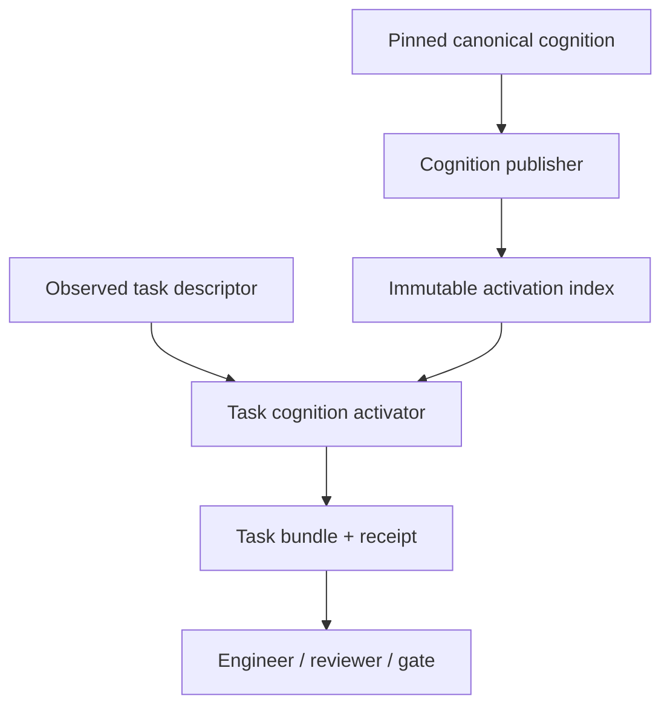

# Qiven Task Cognition Activation Architecture

## A Native, Deterministic, Consumer-First Context Path

> Status: Accepted by ADR-0050 (owner H2 2026-09-23)
> Date: 2026-09-23
> Program: Task Cognition Activation (`TCA`)
> Primary runtime owner: `qiven-runtime`
> Canonical cognition owner: `qiven-context`
> Engineering-process owner: `qiven-devkit`
> Low-level vocabulary owner: `qiven-foundation` and the correct lower semantic layers
> Governance: `qiven-context collaboration/cognitive-governance-program.md`
> Acceptance protocol: `qiven-context collaboration/cognitive-effectiveness-acceptance.md`
> Deliberation record: `qiven-docs accepted/2026-09-23/` (PR #1, seven passes, corrections R1-R15)

## 0. Architectural Decision

Qiven SHALL add a native Runtime-side `TaskCognitionActivator` that compiles one immutable, bounded, explainable `TaskCognitionBundle` from:

- one pinned `CanonicalCognitionBundle` and its execution `RuntimeGeneration`;
- one activation source lock covering exact revisions and content digests of every external Devkit, Foundation, Runtime, or other repository source used by selection;
- one normalized `TaskDescriptor`;
- one canonical `ActivationPolicy`;
- exact repository architecture and capability manifests at pinned revisions;
- explicit live evidence receipts when the task depends on mutable external state.

The activator SHALL return a `ContextActivationReceipt` that binds the produced cognition to the task, source generation, exact dependency lock, policy, consumer profile, risk class, unresolved items, and bundle digest. Issuance alone does not prove delivery to an LLM; the observed harness must record that separately.

The production path SHALL be native and local. It SHALL NOT revive the sealed Python Context compiler/retrieval system. It SHALL NOT call an LLM, embedding service, network service, or remote database to decide protected cognition.

The architecture separates four concerns:

```text
Canonical truth      complete and Git-authoritative
Activation index     rebuildable and immutable per generation
Task bundle          bounded working cognition for one task phase
Activation receipt   auditable proof of what was delivered and why
```

---

## 1. Goals

The system MUST:

1. activate applicable project cognition before material engineering work;
2. protect critical rules from ranking and budget loss;
3. expose semantic ownership and existing lower-layer capabilities before implementation;
4. preserve exact provenance and lifecycle distinctions;
5. make selection and omission explainable;
6. stay fast enough for routine use;
7. keep canonical mutation independent from expensive derived work;
8. bind activation to an immutable RuntimeGeneration and exact task;
9. fail visibly on missing or unresolved critical inputs;
10. support independent fresh-context falsification;
11. let embodied rules leave the default prompt without deleting their history;
12. provide a migration path from the current manual `BOOTSTRAP` retrieval step and active-memory-title sweep.

## 2. Non-Goals

Version 1 does not:

- create a general-purpose agent memory platform;
- make RuntimeJournal a project-knowledge database;
- replace Git-backed Context truth;
- perform arbitrary natural-language entailment;
- rely on embeddings or generative summarization;
- classify every shell command semantically;
- broaden Runtime's current complete-mediation tuple;
- compress all canonical cognition into a lossless token codec;
- infer human identity or governance authority from task text;
- automatically accept designs, code, tests, or ADRs;
- force domain-specific IPC payload semantics into Foundation.

---

## 3. System Topology



The task activator is a cognition delivery component. It does not grant execution authority. A participant with a valid activation receipt still passes all existing permission, H1-H4, publication, Runtime decision, and execution-authority boundaries.

---

## 4. Repository Responsibility Boundaries

### 4.1 `qiven-context`

Owns:

- canonical memory, decisions, obligations, evidence, state, governance, and collaboration contracts;
- lifecycle, provenance, epistemic type, scope, tags, and activation metadata for canonical records;
- one machine-readable `runtime/cognition-activation-policy.yaml` instance;
- one minimal `runtime/cognition-core.yaml` manifest of always-required source references;
- schemas for Context-owned activation selectors;
- after CA-0 atomically introduces the selector schema and bootstraps existing protected records, repository-gate enforcement that every newly created or materially revised protected-class canonical record carries valid activation selector metadata; an unclassified or selector-less protected record then fails the Context gate;
- authoritative references to external engineering and architecture sources.

Does not own:

- the activation engine implementation;
- a mutable search database as truth;
- consumer-specific rendered prompts;
- Runtime cache or receipt state;
- duplicated bodies of Devkit or repository architecture standards.

### 4.2 `qiven-devkit`

Owns:

- the shared engineering task-phase and risk taxonomy;
- `engineering-task-v1` schema and human/agent authoring guidance;
- the cognition-preflight workflow;
- Operator integration for activation and receipt verification;
- the independent-falsification workflow and evidence contract;
- publication gates that require valid receipts for R2/R3 work;
- templates/pointers that let every managed repository discover the activation path.

Does not own:

- project memory or ADR truth;
- repository domain architecture;
- task selection policy for one product domain;
- Runtime activation state.

### 4.3 `qiven-foundation`

Owns:

- generic low-level types and primitives whose semantics are intrinsically foundational;
- strict ownership, lifetime, representation, failure, portability, and cost laws;
- a validated public-surface capability manifest for activation discovery;
- generic hashing/digest, checked-range, immutable-byte, result, and byte-construction/encoding primitives that are separately admitted under ADR-0024. Foundation owns generic storage, bounds, ownership, and scalar-endian mechanics; the format owner retains framing, field order, length-prefix width, compatibility, and versioning.

Does not own:

- hook payload or protocol semantics;
- task activation policy;
- project-specific scars;
- engineering process;
- a generic wrapper around every OS facility.

### 4.4 `qiven-runtime`

Owns:

- canonical bundle ingestion and RuntimeGeneration pinning;
- activation-policy validation;
- activation-index construction and loading;
- task normalization and deterministic applicability resolution;
- protected selection, candidate ranking, budgeting, and diagnostics;
- immutable task-bundle publication;
- receipt issuance, validation, staleness, and audit;
- local IPC/CLI query surfaces;
- cache, metrics, and recovery for derived activation artifacts.

Does not own:

- canonical engineering rules;
- canonical memory bodies;
- acceptance authority;
- participant identity inference;
- mutation of source repositories through the activation path.

### 4.5 Every consuming repository

Owns:

- its architecture and local public contracts;
- a small machine-readable capability surface referring to authoritative headers/docs;
- task-local design documents and cognition compliance maps;
- tests and independent evidence for its implementation.

The capability surface is not a second architecture document. It is a validated index into the repository's real public surface.

---

## 5. Canonical Source Model

### 5.1 Core source categories

The publisher recognizes typed source categories:

| Category | Examples | Default handling |
|---|---|---|
| Core governance | constitution, authority, compact current state | Always available; compact projection in core |
| Accepted decision | ADR | Lifecycle-aware; selected by scope/relation/policy |
| Scar / standing knowledge | active memory | Selector-driven; critical scars protected |
| Future constraint | non-terminal obligation | Trigger/applicability evaluation |
| Engineering law | Devkit standards | Selected by task phase and risk |
| Repository architecture | Foundation/Runtime/local architecture | Selected by repository and boundary kind |
| Capability surface | public types/tools/mechanisms | Selected during semantic-owner discovery |
| Evidence | audits, captures, receipts | Selected when proof or incident detail is needed |
| Historical material | superseded/legacy | Excluded by default; explicit history only |

### 5.2 No body duplication

An activation rule references canonical source IDs/paths and optional sections. It does not restate the full rule text.

Example:

```yaml
id: RULE-cpp-borrowed-range-lifetime
status: active
priority: protected
selectors:
  phases: [design, implementation, review]
  languages: [cpp]
  boundary_kinds: [borrowed_view, async_lifetime, ipc_payload]
sources:
  - repo: JasonHuang3D/qiven-devkit
    path: docs/engineering/implementation-standard.md
    section: Ownership and lifetime
  - repo: JasonHuang3D/qiven-foundation
    path: docs/architecture/foundation.md
    section: Representation and boundary law
expected_controls:
  - explicit_owner
  - outlives_relation
  - regression_lifetime_path
independent_evidence: required
```

The source text remains canonical in the named repositories. The policy binds applicability and expected control.

---

## 6. Task Descriptor

### 6.1 Purpose

`TaskDescriptor` is a normalized assertion about the work being attempted. It is a selector, not project truth or authority evidence.

Runtime builds it from a combination of:

- owner-authorized task or accepted obligation;
- feature specification;
- repository and exact base revisions;
- observed paths and build targets;
- explicit task-client fields;
- harness-observed action/resource data where available.

Participant-declared values are labelled `claimed`; observed values are labelled `observed`. A contradiction cannot silently resolve in favor of the participant.

### 6.2 Schema sketch

```json
{
  "schema": "qiven-engineering-task-v1",
  "task_id": "<128-bit-id>",
  "title": "MVP-5 typed record candidate transaction",
  "phase": "design",
  "risk_class": "R2",
  "objective_ref": "OBL-...",
  "repositories": [
    {
      "name": "JasonHuang3D/qiven-runtime",
      "revision": "<git-oid>",
      "role": "implementation_owner"
    }
  ],
  "touches": {
    "paths": ["src/record", "include/qiven/runtime/record"],
    "subsystems": ["record", "git_candidate", "serialization"],
    "languages": ["cpp"],
    "platforms": ["windows"]
  },
  "boundary_kinds": [
    "ownership",
    "filesystem_transaction",
    "git_cas",
    "persistent_representation"
  ],
  "operation_kinds": ["add_public_type", "produce_external_effect"],
  "external_contracts": ["qiven-context-schema", "git-ref-cas"],
  "changed_paths": [],
  "signals": ["before-implementation"],
  "explicit_ids": ["ADR-0047"],
  "input_evidence": [],
  "consumer_profile": "zcode-jason",
  "requested_budget": {
    "canonical_json_bytes": 65536
  }
}
```

### 6.3 Normalization

Runtime normalizes:

- repository names and exact revisions;
- paths relative to verified repository roots;
- phase and risk enums;
- language/platform/boundary vocabularies;
- IDs and source references;
- observed-vs-claimed provenance;
- task digest over the complete normalized descriptor.

Unknown enum values fail visibly. Unknown applicability is not equivalent to false.

---

## 7. Activation Policy

### 7.1 Policy role

`runtime/cognition-activation-policy.yaml` maps deterministic task characteristics to required cognition and expected evidence. It is the machine instance of accepted governance, not an independently authored parallel constitution.

### 7.2 Policy rule fields

Each rule contains:

- stable ID and lifecycle status;
- priority class;
- deterministic selectors;
- source references;
- expected design controls;
- expected test/evidence controls;
- whether independent falsification is required;
- optional freshness requirements;
- supersession/replacement references;
- reason/provenance pointer.

### 7.3 Selector vocabulary

Version 1 supports exact, deterministic selectors only:

- repository and semantic layer;
- path prefix and file kind;
- engineering phase;
- risk class;
- language and platform;
- subsystem;
- operation kind;
- boundary kind;
- explicit record/ADR/obligation ID;
- exact tags/scopes;
- changed component;
- named external contract;
- explicit positive/negative condition with evidence completeness.

No arbitrary regular expression over source bodies may create a protected obligation without review. Lexical matching is permitted for candidate ranking, not protected applicability.

### 7.4 Priority classes

| Priority | Meaning | Budget behavior |
|---|---|---|
| `P0-core` | Minimal universal cognition | Always included |
| `P1-protected` | Applicable or safety-relevant unresolved rule | Cannot be silently truncated |
| `P2-required` | Task architecture, capabilities, accepted decisions | Included before ranked evidence |
| `P3-supporting` | Scars/evidence/related material | Ranked within budget |
| `P4-on-demand` | Historical bodies, deep audits, alternatives | Referenced, fetched only when requested |

If P0-P2 exceed the active budget, activation fails with `BudgetInsufficient`; it does not silently omit governance.

---

## 8. Repository Capability Surface

### 8.1 Purpose

An LLM cannot choose the correct lower semantic owner if it cannot cheaply discover what the lower layers already provide. Every native repository SHALL therefore expose a small validated capability surface.

Recommended path:

```text
.qiven/cognition-surface.yaml
```

### 8.2 Entry shape

```yaml
schema_version: 1
repository: JasonHuang3D/qiven-foundation
revision_policy: exact_git_revision
capabilities:
  - id: qiven.byte_cursor
    kind: public_type
    header: include/qiven/byte_cursor.hpp
    architecture_ref: docs/architecture/foundation.md#representation-and-boundary-law
    semantics: bounded_non_owning_sequential_byte_read
    owns_storage: false
    tags: [bytes, parsing, bounded-range, borrowed-view]
    hazards: [backing_storage_must_outlive_cursor]
  - id: qiven.memory.owned_array
    kind: public_type
    header: include/qiven/memory/owned_array.hpp
    architecture_ref: docs/architecture/foundation.md#memory-and-ownership
    semantics: move_only_owned_contiguous_live_objects
    owns_storage: true
    tags: [ownership, array, allocation]
```

### 8.3 Validation

The repository gate verifies:

- referenced files exist;
- named public symbols are present through a compile/AST probe where practical;
- architecture references resolve;
- capability IDs are unique;
- removed symbols invalidate or supersede their entries;
- the manifest is pinned to the repository revision in the canonical bundle.

The surface must stay small. It indexes public semantic capabilities, not every function or private helper.

---

## 9. Activation Index

### 9.1 Authority boundary

The activation index is a rebuildable derivative of an exact canonical bundle. It is never RuntimeJournal data and never canonical project truth.

### 9.2 Physical form

Version 1 uses a separate immutable SQLite database in a derivative sidecar:

```text
canonical-bundle/                 # existing qiven-cognition-bundle-v1, immutable
  manifest.json
  snapshot.qvs
  policy.yaml
  source/...
activation-generations/<id>/     # new derivative, separately published
  source-lock.json
  source/...                  # exact external excerpts and capability manifests
  index.sqlite
  index-manifest.json
```

The publisher resolves external source repositories from an exact, validated local Git revision lock and copies the needed files into the derivative generation; task activation does not fetch from the network or read a dirty checkout. The lock names each repository commit/tree, selected path, and content digest. The index manifest binds the existing canonical-bundle digest, its execution `RuntimeGeneration`, the activation policy, and the complete external source lock. A change to an external source creates a new `ActivationGeneration`; it does not silently mutate the already-published canonical bundle or by itself rotate the execution `RuntimeGeneration`. Build the sidecar privately, validate and hash it, then switch the activation-generation pointer atomically. Runtime opens the completed index read-only and immutable.

Using SQLite here does not weaken the MVP rule that SQLite is not Context domain truth:

- canonical source bodies remain Git-backed files;
- the index can be deleted and rebuilt;
- the index never receives independent writes;
- no activation result can override lifecycle or content in canonical sources;
- the Runtime control journal and activation index are separate databases with separate schemas and lifecycles.

### 9.3 Minimal schema

```text
sources(
  source_id, repository, revision, path, content_sha256,
  kind, lifecycle, title, scope_json, tags_json, body_offset
)

relations(from_source_id, relation_kind, to_source_id)

selectors(rule_id, selector_kind, selector_value, priority)

rule_sources(rule_id, source_id, section_ref, expected_controls_json)

capabilities(
  capability_id, repository, revision, kind, public_ref,
  semantics, owns_storage, tags_json, hazards_json
)

obligations(
  source_id, status, trigger_type, trigger_value, completion_ref
)

documents(source_id, normalized_text)
```

FTS5 MAY be enabled for deterministic candidate ranking if the pinned SQLite build includes and tests it. Protected selection never depends on FTS. A simple deterministic inverted index is an acceptable v1 substitute if enabling FTS would expand the dependency batch.

### 9.4 Rebuild strategy

The initial implementation may rebuild the small index fully for each new canonical generation. Premature incremental complexity is prohibited until measurement shows the full native build exceeds the performance objective.

Index cache key:

```text
sha256(
  canonical_bundle_sha256 ||
  runtime_generation_id ||
  sorted_external_source_lock(repo_commit, tree_oid, path, content_sha256) ||
  activation_policy_sha256 ||
  schema_version ||
  publisher_build_id
)
```

Cache reuse is permitted only on exact key equality. `ActivationGeneration` identifies this complete closure. The original `RuntimeGeneration` still identifies the execution-control bundle under the Production MVP contract; the two identifiers MUST NOT be conflated.

---

## 10. Deterministic Activation Pipeline

The pipeline executes in this fixed order.

### Step 1 — Pin and validate generation

Validate the active canonical bundle, activation index digest, policy digest, full external source lock, execution `RuntimeGeneration`, and `ActivationGeneration`. A partially published or stale generation is rejected.

### Step 2 — Normalize the task

Parse and validate `TaskDescriptor`; resolve repository roots/revisions; merge observed facts; retain contradictions as diagnostics.

### Step 3 — Load P0 core

Load a compact projection of:

- authority identity;
- current objective and boundary;
- canonical-source rules;
- current participant/workflow profile;
- non-negotiable no-invention/no-authority-from-context laws.

The core contains references and compact invariants, not the complete operating corpus.

### Step 4 — Evaluate protected rules

Evaluate deterministic selectors against observed and complete claimed inputs. Results are:

- `applicable`;
- `not_applicable` with evidence;
- `unresolved`;
- `contradictory`.

`unresolved` and `contradictory` critical rules remain in the bundle and may block readiness.

### Step 5 — Resolve semantic ownership

Traverse the declared dependency hierarchy and capability surfaces:

1. identify the semantic layer of the requested capability;
2. locate existing public capabilities matching task tags/boundaries;
3. surface known hazards and ownership semantics;
4. detect potential local duplication;
5. report `NoKnownCapability` honestly when none exists.

The engine suggests evidence; the design still decides whether a capability fits. A capability match never automatically authorizes a dependency.

### Step 6 — Select accepted decisions and architecture

Include exact accepted ADRs and repository architecture sections directly governing the task. Superseded/legacy decisions are excluded unless needed to explain a rejected alternative or conflict.

### Step 7 — Evaluate obligations

Evaluate non-terminal obligations with the existing three-valued semantics. Before-obligations applicable to the task are protected. Relation alone does not make an unrelated obligation active.

### Step 8 — Select scars and supporting evidence

Select active scars by exact scope/tag/boundary signals and one-hop relations. Include compact scar cards by default:

```text
failure class
applicability
mandatory control
required proof
canonical source link
```

Include the full incident body only when the task or reviewer needs it.

### Step 9 — Rank optional candidates

Within the remaining budget, apply deterministic lexical/path/tag/title scoring. Exact matches outrank body overlap. Optional semantic reranking is post-MVP-7 work and cannot remove protected items.

### Step 10 — Build readiness result

Return one of:

- `ReadyForPhase`;
- `NeedsEvidence`;
- `ReDeliberate`;
- `Blocked`;
- `StaleGeneration`;
- `BudgetInsufficient`.

The result lists every blocking or unresolved condition.

### Step 11 — Publish bundle and receipt

Build in a private directory, hash every output, write manifest last, then atomically publish. Persist the receipt and audit summary in Runtime control state; the bundle remains a derivative artifact.

---

## 11. Task Cognition Bundle

### 11.1 Layout

```text
task-cognition/
  manifest.json
  task.json
  core.json
  activation.json
  capabilities.json
  obligations.json
  diagnostics.json
  sources/
    <selected exact source bodies or bounded excerpts>
  render/
    llm.md
```

### 11.2 Manifest fields

At minimum:

```json
{
  "schema": "qiven-task-cognition-bundle-v1",
  "bundle_id": "<deterministic-id>",
  "task_id": "<stable-task-id>",
  "task_sha256": "<sha256>",
  "runtime_generation": "<id>",
  "activation_generation": "<id>",
  "external_source_lock_sha256": "<sha256>",
  "canonical_bundle_sha256": "<sha256>",
  "activation_policy_sha256": "<sha256>",
  "activation_index_sha256": "<sha256>",
  "consumer_profile": "zcode-jason",
  "phase": "design",
  "risk_class": "R2",
  "readiness": "ReadyForPhase",
  "source_files": [
    {
      "repository": "...",
      "revision": "...",
      "path": "...",
      "sha256": "...",
      "selection_reason": ["protected-rule:RULE-..."]
    }
  ],
  "unresolved": [],
  "publisher_build": "<build-id>"
}
```

Canonical selection files and their manifest contain no issuance timestamp, random identifier, or volatile path. `bundle_id` is deterministically derived from the canonical selection inputs without a self-referential hash; issuance time and nonce belong only to the receipt/audit envelope. Byte-identical source closure, task, policy, budget, and renderer yield byte-identical canonical bundle bytes. The proof compares those bytes and separately verifies the receipt binding.

### 11.3 Rendering law

The canonical bundle is machine-readable. Renderers produce consumer-specific Markdown or structured tool results without changing selection semantics.

The LLM renderer orders cognition as:

1. task and stop boundary;
2. blocking/unresolved items;
3. critical invariants and scars;
4. semantic-owner and capability map;
5. required design/test evidence;
6. current state and relevant obligations;
7. supporting sources and on-demand references.

It does not lead with historical narrative or governance ceremony when the task is a local ownership design.

---

## 12. Context Activation Receipt

### 12.1 Purpose

The receipt proves which task cognition was produced. It does not prove that the bundle reached a model or that the model understood it, and it does not grant execution or publication authority. A separately captured harness delivery event is required for a before-phase delivery claim.

### 12.2 Required fields

```json
{
  "schema": "qiven-context-activation-receipt-v1",
  "receipt_id": "<128-bit-id>",
  "task_id": "<128-bit-id>",
  "task_sha256": "<sha256>",
  "bundle_sha256": "<sha256>",
  "runtime_generation": "<id>",
  "activation_generation": "<id>",
  "external_source_lock_sha256": "<sha256>",
  "consumer_profile": "<profile>",
  "renderer_build": "<build-id>",
  "activation_policy_sha256": "<sha256>",
  "phase": "design",
  "risk_class": "R2",
  "readiness": "ReadyForPhase",
  "protected_rule_ids": ["..."],
  "unresolved_ids": [],
  "required_evidence": ["fresh-review", "real-payload-capture"],
  "issued_at": "<rfc3339>",
  "freshness": {
    "expires_at": null,
    "mutable_evidence_expires_at": "<optional-rfc3339>"
  }
}
```

### 12.3 Binding and invalidation

A receipt becomes invalid when:

- the normalized task changes materially;
- the source execution RuntimeGeneration or ActivationGeneration changes;
- the external source lock, activation policy, or renderer semantics change;
- the engineering phase changes and policy requires reactivation;
- repository base revisions change for a source or target bound to the task;
- mutable evidence expires;
- the design introduces a boundary kind absent from the task descriptor;
- an unexpected failure class appears;
- a critical source is superseded or withdrawn.

An activation receipt is issued before the design exists and therefore never contains a design digest. A later design edit alone does not invalidate it unless the edit changes a selector-bearing task attribute, scope, boundary, risk, source revision, or required evidence. Devkit binds the exact design digest to the pre-existing receipt in a separate design-evidence record and requires renewed independent review for a changed design/candidate digest. It must not backdate or regenerate a pre-design activation receipt to make late activation look timely.

R2/R3 design evidence carries a machine-readable `declared_boundary_kinds` set. Devkit mechanically compares that set with the task descriptor bound to the receipt; any added kind invalidates the receipt and requires reactivation. The remaining seam is completeness: a design can omit a boundary it actually introduces. The independent reviewer MUST challenge that semantic completeness. It is not asked to perform a set comparison that the gate can enforce directly.

---

## 13. Engineering Workflow Integration

### 13.1 Operator surface

Devkit SHALL expose one canonical command family, backed by Runtime when available:

```text
qiven cognition prepare --task-file <path> --phase <phase>
qiven cognition show <receipt-id>
qiven cognition verify-receipt <receipt-file>
qiven cognition explain <bundle-id> <source-id>
```

Long content is passed through files or stdin, never embedded in shell command strings.

### 13.2 Runtime control surface

`qiven-runtimectl` SHALL support:

```text
cognition activate --task-file <path> --output <directory>
cognition activation show <receipt-id>
cognition activation explain <receipt-id> <source-id>
cognition index status
cognition index rebuild <exact-source-revision>
```

Before the resident service integration is accepted, a bounded one-shot native command may exercise the same core library. There SHALL NOT be two activation semantics. A successful CLI call or SessionStart refresh only proves activation computation or session setup; neither proves that the resulting bundle reached a model invocation before design.

### 13.3 Design evidence

R2/R3 design documents include:

```text
Task descriptor digest:
Activation receipt (issued before design):
ActivationGeneration and external source lock:
Harness delivery event and phase-entry timestamp, when a before-phase claim is made:
Design-evidence digest (computed after the design exists):
Declared boundary kinds:
Activated protected rules:
Semantic owner decision:
Capability reuse decision:
Unresolved items:
Cognition compliance map:
Independent falsification plan:
```

### 13.4 Gate behavior

For R2/R3 publication, Devkit verifies:

- receipt schema and signature/digest integrity;
- exact source RuntimeGeneration and ActivationGeneration, including the external source lock;
- exact task digest on the activation receipt plus a separate design-evidence record binding the design digest, receipt ID, and candidate revision;
- exact equality between the design's declared boundary-kind set and the set bound to the receipt, or a newer pre-design receipt covering the changed set;
- no unresolved blocker;
- required independent evidence receipt exists;
- design compliance map covers every activated protected rule;
- changed paths stay inside declared task scope or trigger reactivation;
- for a claimed before-design/implementation/review activation, the observed phase-entry and harness delivery events show that this exact bundle reached the named consumer before that phase began. If that event cannot be observed, publication may prove receipt conformance but MUST NOT claim before-phase delivery or universal task interception.

CA-2 qualifies at least one real, controlled R2/R3 task-entry path before MVP-5 dogfood: the task is admitted, the exact bundle is delivered as model-visible input, and the first design output is captured under the same invocation chain. Test withheld, altered, and late delivery. The present MVP-4 `SessionStart`/`PreToolUse` hook observes session and tool events, not model-input delivery or design start by itself; use it only for the events it actually proves. If no supported harness ingress or approved orchestrator can provide and capture this boundary, CA-2 remains open. A publication-time receipt cannot make an unobserved earlier design compliant.

The gate does not attempt to judge arbitrary natural-language correctness. It verifies declared, typed relationships and stops when evidence is missing.

---

## 14. Independent Falsification Interface

### 14.1 Review package

The activator emits a sealed reviewer package containing:

- task descriptor;
- task cognition bundle;
- candidate design;
- cognition compliance map;
- test spine;
- exact source refs;
- review rubric.

It excludes the author's hidden reasoning transcript and conclusion-oriented coaching.

### 14.2 Review result

```json
{
  "schema": "qiven-cognitive-falsification-receipt-v1",
  "task_id": "...",
  "design_sha256": "...",
  "activation_bundle_sha256": "...",
  "reviewer_profile": "fresh-capable-llm",
  "findings": [
    {
      "severity": "material",
      "class": "ownership_lifetime",
      "source_refs": ["..."],
      "claim": "..."
    }
  ],
  "verdict": "revise",
  "sealed_at": "..."
}
```

An authoring session integrates findings and renews the design-evidence/falsification binding for a changed design digest. It obtains a new activation receipt only when the task's selector-bearing facts or pinned sources change.

---

## 15. Budget Model

### 15.1 Canonical versus rendered budget

Canonical JSON byte budgets remain deterministic. Consumer renderers may also estimate model-specific tokens, but tokenizer variance cannot change protected inclusion.

Initial objectives:

| Artifact | Default objective | Hard behavior |
|---|---:|---|
| Compact core | <= 12 KiB UTF-8 | Fail publication if exceeded without governance review |
| Task activation payload | <= 64 KiB UTF-8 | Protected overflow returns `BudgetInsufficient` |
| One automatically inlined source body | <= 8 KiB | Larger body becomes bounded excerpt + exact source reference unless critical full body is required |
| Supporting evidence bodies | <= 25% of task bundle | Excess moves to on-demand tier |

These numbers are starting controls, not universal truths. The Cognitive Effectiveness protocol may amend them with measured evidence.

### 15.2 Prompt retirement

An embodied, regression-proven scar may move from an inlined P1 body to:

- one compact invariant;
- one capability/control reference;
- one canonical evidence link.

If the embodiment later weakens or a recurrence occurs, policy promotes the full scar again.

---

## 16. Failure Semantics

| Failure | Result | Mutation/authority effect |
|---|---|---|
| Missing canonical source | `Blocked` | No ready receipt |
| Bundle/index digest mismatch | `StaleGeneration` / quarantine | Old valid generation remains active |
| Unknown critical applicability | `ReDeliberate` | Critical record included; no ready receipt |
| Insufficient protected budget | `BudgetInsufficient` | No silent truncation |
| Optional ranking failure | Ready only if protected/required selection complete; diagnostic recorded | No authority grant |
| Task/repository revision mismatch | `StaleTask` | Reactivation required |
| Capability manifest inconsistency | `NeedsEvidence` or `Blocked` by risk | No invented capability |
| Mutable evidence expired | `NeedsEvidence` | Refresh required |
| Renderer failure | Machine bundle remains valid; requested view unavailable | No fallback that changes selection |
| Activation journal unavailable | Fail visibly for gated R2/R3 work | No fabricated receipt |

---

## 17. Concurrency, Publication, and Recovery

### 17.1 Generation publication

One publisher builds a candidate cognition generation. Multiple task activations may read the currently active immutable generation concurrently.

Publication sequence:

1. pin the existing immutable canonical bundle and execution RuntimeGeneration;
2. resolve and validate every external repository revision and source digest into a complete source lock;
3. build a separate activation-index sidecar from that exact closure in private storage;
4. validate schemas, references, lifecycle, index integrity, and digests;
5. persist ActivationGeneration metadata;
6. atomically switch the activation-generation pointer;
7. mark old unconsumed activation receipts stale according to policy, without rotating execution Allows solely because an external cognition source changed.

### 17.2 Crash semantics

- Crash before pointer switch: candidate is unactivated and may be deleted/rebuilt.
- Crash after activation-pointer switch but before acknowledgement: recover pointer and manifest; classify activation by exact digest.
- Partial index never becomes active.
- RuntimeJournal records control facts only: generation identity, build outcome, receipt issuance, and barriers. The index content remains external derivative material.

### 17.3 Task-cache semantics

Task bundles may be cached only by an exact normalized key covering task digest, both generation IDs, the complete source lock, policy, consumer profile, renderer build, budget, and any live-evidence binding. A cache hit revalidates manifest/digests and mutable-evidence freshness. Approximate task matching is forbidden for receipt reuse.

---

## 18. Security and Robustness

The implementation MUST defend against:

- malformed YAML/JSON and excessive nesting;
- oversized source files and aggregate bundles;
- path traversal, symlinks/reparse-point escape, and repository-root substitution;
- duplicate or conflicting stable IDs;
- forged source revisions or digests;
- task text attempting to grant authority;
- source prose attempting to change instruction precedence outside its typed category;
- stale/superseded lifecycle records entering default current activation;
- cache poisoning across generations;
- receipt replay against a changed task/design;
- secret material accidentally indexed or rendered;
- denial of service through adversarial query terms or relation expansion.

Canonical record content is trusted only according to its epistemic and authority type. A memory observation cannot become an accepted decision merely because it contains imperative prose.

---

## 19. Observability

Required events and metrics:

- generation build start/result/duration;
- source and policy digests;
- task normalization result and observed/claimed contradictions;
- selected sources by priority/reason;
- protected unresolved items;
- optional candidates omitted by budget;
- semantic-owner and capability matches;
- activation latency and rendered size;
- cache hit/miss;
- receipt issuance/staleness/validation failure;
- review findings and recurrence links;
- prompt-retirement promotions/demotions;
- canonical mutation-to-active-generation lag.

Logs do not contain full private record bodies by default. IDs, digests, paths, and bounded diagnostics are sufficient for most operations.

---

## 20. Source Layout

Recommended Runtime layout:

```text
include/qiven/runtime/cognition/
  task_descriptor.hpp
  activation_policy.hpp
  activation_index.hpp
  task_activator.hpp
  task_bundle.hpp
  activation_receipt.hpp
  activation_explain.hpp

src/cognition/
  task_descriptor.cpp
  activation_policy.cpp
  activation_index.cpp
  task_activator.cpp
  task_bundle.cpp
  activation_receipt.cpp

schemas/cognition/
  engineering-task-v1.schema.json
  activation-policy-v1.schema.json
  task-cognition-bundle-v1.schema.json
  context-activation-receipt-v1.schema.json
  cognitive-falsification-receipt-v1.schema.json
```

Recommended canonical additions:

```text
qiven-context/
  runtime/cognition-core.yaml
  runtime/cognition-activation-policy.yaml
  schema/cognition-activation-policy.schema.json

qiven-devkit/
  docs/engineering/cognition-preflight.md
  docs/engineering/independent-falsification.md
  schemas/engineering-task-v1.schema.json

each managed native repository/
  .qiven/cognition-surface.yaml
```

Schema ownership must remain singular. If Runtime consumes a Devkit-owned task schema, Devkit is pinned and the schema is imported or vendored through the accepted first-party dependency mechanism; it is not copied and edited independently.

---

## 21. Migration from Current Cold Boot

### Phase A — Coexistence

- Current `BOOTSTRAP` remains authoritative.
- Activator runs in shadow mode and records what it would include.
- Compare activator output against manual expert retrieval and existing cold-boot reconstruction.
- No mandatory prose is removed.

### Phase B — Governed activation

- R2/R3 engineering work requires activation receipts.
- Current manual retrieval remains available as evidence fallback, not primary selection.
- Active-memory-title sweep remains temporarily as defense in depth.

### Phase C — Replacement acceptance

After the Cognitive Effectiveness protocol passes:

- `BOOTSTRAP` loads compact core and invokes activation instead of requiring broad manual reading;
- full memory index remains queryable but is no longer injected/swept as active text;
- long operating-contract sections become task-selectable sources;
- emergency duplicate rule bodies are replaced by canonical pointers and selectors;
- the old reading-agent retrieval instruction is retired.

No subtraction occurs before replacement acceptance proves semantic coverage.

---

## 22. Definition of Done

Task Cognition Activation v1 is complete when:

1. one exact canonical bundle and external source lock produce a reproducible activation index in a separate derivative sidecar;
2. one normalized task produces a deterministic bundle and receipt;
3. every protected applicable rule is included regardless of candidate budget;
4. unknown critical applicability fails visibly;
5. semantic-owner discovery surfaces the relevant Foundation/Runtime capabilities and hazards for accepted fixtures;
6. lifecycle and authority types remain intact;
7. stale generations, tasks, designs, policies, and evidence invalidate receipts correctly;
8. a crash cannot activate a partial index or bundle;
9. canonical mutation and activation publication remain separate and recoverable;
10. warm activation meets the measured latency objective;
11. R2/R3 Devkit gates validate receipts and independent evidence;
12. isolated fresh-consumer trials pass the companion acceptance protocol;
13. no network, model call, or sealed Python component participates in the v1 activation path;
14. current Runtime enforcement claims remain honest and unbroadened;
15. the replacement is strong enough to retire the manual active-memory-title sweep without losing a protected rule.
